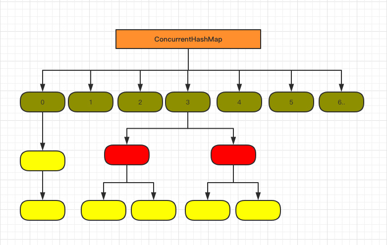

= ConcurrentHashMap深入学习
:toc: left
:icons: font
:sectanchors: 
:toclevels: 4
:source-highlighter: pygments
:pygments-style: manni
:source-linenums-option: 

== JDK1.7
=== 存储结构

image::images/5b61a15a0001880205000255.jpg[]

如图所示，是由 Segment 数组、HashEntry 组成，和 HashMap 一样，仍然是数组加链表,他的核心成员变量：

[source,java]
----
 final Segment<K,V>[] segments;

 static final class Segment<K,V> extends ReentrantLock implements Serializable {
 	        
 	    transient volatile HashEntry<K,V>[] table;

        transient int count;

        transient int modCount;

        transient int threshold;

        final float loadFactor;
 }
----

ConcurrentHashMap 采用了分段锁技术，其中 Segment 继承于 ReentrantLock。不会像 HashTable 那样不管是 put 还是 get 操作都需要做同步处理，理论上 ConcurrentHashMap 支持 CurrencyLevel (Segment 数组数量)的线程并发。每当一个线程占用锁访问一个 Segment 时，不会影响到其他的 Segment。

=== 获取值

[source,java]
----
	    public V put(K key, V value) {
	        Segment<K,V> s;
	        if (value == null)
	            throw new NullPointerException();
	        int hash = hash(key);
	        int j = (hash >>> segmentShift) & segmentMask;
	        if ((s = (Segment<K,V>)UNSAFE.getObject          <1>
	             (segments, (j << SSHIFT) + SBASE)) == null) 
	            s = ensureSegment(j);
	        return s.put(key, hash, value, false);
	    }
	        
        final V put(K key, int hash, V value, boolean onlyIfAbsent) {
            HashEntry<K,V> node = tryLock() ? null : <2>
                scanAndLockForPut(key, hash, value); 
            V oldValue;
            try {
                HashEntry<K,V>[] tab = table;
                int index = (tab.length - 1) & hash; <3>
                HashEntry<K,V> first = entryAt(tab, index);
                for (HashEntry<K,V> e = first;;) {
                    if (e != null) {
                        K k;
                        if ((k = e.key) == key ||
                            (e.hash == hash && key.equals(k))) { <4>
                            oldValue = e.value;
                            if (!onlyIfAbsent) {
                                e.value = value;
                                ++modCount;
                            }
                            break;
                        }
                        e = e.next;
                    }
                    else {
                        if (node != null)
                            node.setNext(first);
                        else
                            node = new HashEntry<K,V>(hash, key, value, first);
                        int c = count + 1;
                        if (c > threshold && tab.length < MAXIMUM_CAPACITY) <5>
                            rehash(node);
                        else
                            setEntryAt(tab, index, node);
                        ++modCount;
                        count = c;
                        oldValue = null;
                        break;
                    }
                }
            } finally {
                unlock();
            }
            return oldValue;
        }
----

<1> 通过 key 定位到 Segment，之后在对应的 Segment 中进行具体的 put。
<2> 尝试获取锁，如果获取失败肯定就有其他线程存在竞争，则利用 scanAndLockForPut() 自旋获取锁。
<3> 将当前 Segment 中的 table 通过 key 的 hashcode 定位到 HashEntry。
<4> 遍历该 HashEntry，如果不为空则判断传入的 key 和当前遍历的 key 是否相等，相等则覆盖旧的 value。
<5> 不为空则需要新建一个 HashEntry 并加入到 Segment 中，同时会先判断是否需要扩容。

== JDK1.8
1.7 已经解决了并发问题，并且能支持 N 个 Segment 这么多次数的并发，但依然存在 HashMap 在 1.7 版本中的问题。那就是查询遍历链表效率太低。因此 1.8 做了一些数据结构上的调整。首先来看下底层的组成结构：

看起来是不是和 1.8 HashMap 结构类似？其中抛弃了原有的 Segment 分段锁，而采用了 CAS + synchronized 来保证并发安全性;同时也将 1.7 中存放数据的 HashEntry 改为 Node，但作用都是相同的。

[source,java]
----
    private transient volatile int sizeCtl; <1>
----

<1> 表初始化和调整大小控制。 当为负数时，表正在初始化或调整大小：-1表示初始化，否则为调整大小。当new ConcurrentHashMap(10)完还没有put值的时候，改值等于10。new ConcurrentHashMap()时的值为0.初始化成功之后，改值成为阀值，大于改值，说明map需要扩容了 

[reftext="ViewResolver"]
[source,java]
----
    private final Node<K,V>[] initTable() {
        Node<K,V>[] tab; int sc;
        while ((tab = table) == null || tab.length == 0) {
            if ((sc = sizeCtl) < 0)
                Thread.yield(); // lost initialization race; just spin
            else if (U.compareAndSwapInt(this, SIZECTL, sc, -1)) {
                try {
                    if ((tab = table) == null || tab.length == 0) {
                        int n = (sc > 0) ? sc : DEFAULT_CAPACITY;
                        @SuppressWarnings("unchecked")
                        Node<K,V>[] nt = (Node<K,V>[])new Node<?,?>[n];
                        table = tab = nt;
                        sc = n - (n >>> 2);
                    }
                } finally {
                    sizeCtl = sc;
                }
                break;
            }
        }
        return tab;
    }
----

=== 添加值

[source,java]
----
    final V putVal(K key, V value, boolean onlyIfAbsent) {
        if (key == null || value == null) throw new NullPointerException();
        int hash = spread(key.hashCode());
        int binCount = 0;
        for (Node<K,V>[] tab = table;;) {
            Node<K,V> f; int n, i, fh;
            if (tab == null || (n = tab.length) == 0) <1>
                tab = initTable();
            else if ((f = tabAt(tab, i = (n - 1) & hash)) == null) { <2>
                if (casTabAt(tab, i, null,
                             new Node<K,V>(hash, key, value, null)))
                    break;                   // no lock when adding to empty bin
            }
            else if ((fh = f.hash) == MOVED) <3>
                tab = helpTransfer(tab, f);
            else {
                V oldVal = null;
                synchronized (f) { <4>
                    if (tabAt(tab, i) == f) {
                        if (fh >= 0) {
                            binCount = 1;
                            for (Node<K,V> e = f;; ++binCount) {
                                K ek;
                                if (e.hash == hash &&
                                    ((ek = e.key) == key ||
                                     (ek != null && key.equals(ek)))) {
                                    oldVal = e.val;
                                    if (!onlyIfAbsent)
                                        e.val = value;
                                    break;
                                }
                                Node<K,V> pred = e;
                                if ((e = e.next) == null) {
                                    pred.next = new Node<K,V>(hash, key,
                                                              value, null);
                                    break;
                                }
                            }
                        }
                        else if (f instanceof TreeBin) {
                            Node<K,V> p;
                            binCount = 2;
                            if ((p = ((TreeBin<K,V>)f).putTreeVal(hash, key,
                                                           value)) != null) {
                                oldVal = p.val;
                                if (!onlyIfAbsent)
                                    p.val = value;
                            }
                        }
                    }
                }
                if (binCount != 0) { 
                    if (binCount >= TREEIFY_THRESHOLD) <5>
                        treeifyBin(tab, i);
                    if (oldVal != null)
                        return oldVal;
                    break;
                }
            }
        }
        addCount(1L, binCount);
        return null;
    }
----

<1> 如果是首次添加，则初始化，采用CAS算法，保证原子性,参考<<ViewResolver>>
<2> f 即为当前 key 定位出的 Node，如果为空表示当前位置可以写入数据，利用 CAS 尝试写入，失败则自旋保证成功。
<3> 如果当前位置的 hashcode == MOVED == -1,则需要进行扩容。
<4> 如果都不满足，则利用 synchronized 锁写入数据。
<5> 如果数量大于 TREEIFY_THRESHOLD 则要转换为红黑树。

=== 获取值

根据计算出来的 hashcode 寻址，如果就在桶上那么直接返回值。如果是红黑树那就按照树的方式获取值。就不满足那就按照链表的方式遍历获取值

=== 用途

. 用作缓存，防止并发
