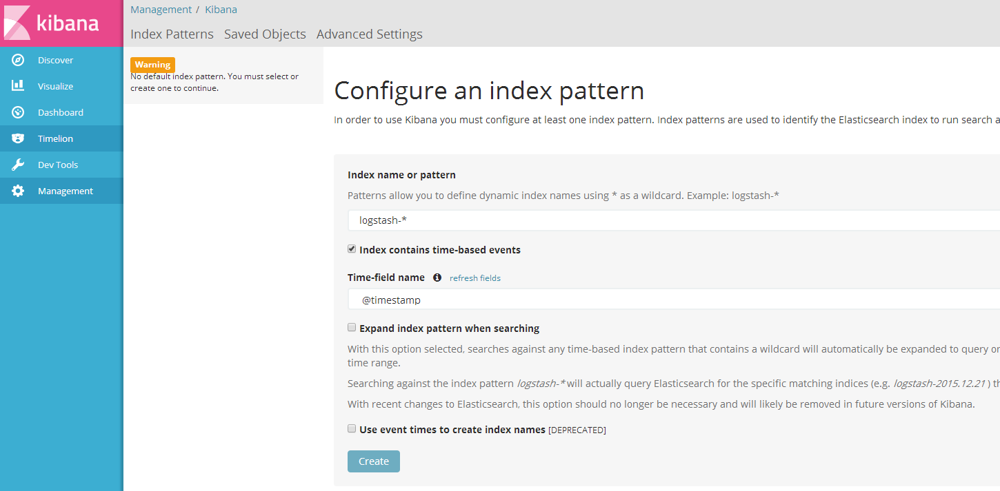

#安装环境
* win7/linux(把bat命令替换成sh命令即可)
* elasticsearch-5.4.1
* kibana-5.4.1-windows-x86
* logstash-5.4.1
#安装步骤
## 1.elasticsearch安装
双击bin目录下面的elasticsearch.bat启动即可
## 2.logstash安装
在bin目录下面创建logstash.conf文件,内容如下:
````
input{
    stdin{

    }
}
output{
    elasticsearch{
        hosts => ["127.0.0.1:9200"]
        index => "logstash-%{+YYYY.MM.dd}"
        document_type => "form"
        document_id => "%{id}"
    }
    stdout{
        codec => json_lines
    }
}
````

## kibana安装
双击bin目录下面的kibana.bat即可

## kibana配置
访问地址 http://localhost:5601/  http://localhost:5601/app/kibana

点击create创建.
注意如果create为禁用状态,请在logstash的控制台随便输入一会话后回车

到这里,ELK整个安装过程结束,下面是spring cloud 和 ELK的结合使用

修改logstash配置
````
input{
    stdin{

    }
    tcp {
        host => "127.0.0.1"
        port => 9250
        mode => "server"
        tags => ["tags"]
        codec => json_lines  
    }
}
output{
    elasticsearch{
        hosts => ["127.0.0.1:9200"]
        index => "logstash-%{+YYYY.MM.dd}"
        document_type => "form"
        document_id => "%{id}"
    }
    stdout{
        codec => json_lines
    }
}
````
>说明:stdin是监听命令行输入.stdout是命令行输出.tcp只是一个名字,而不是特定的tcp协议,所以这里也可以改成TcpOther等名字

**注意:ELK中的配置文件默认地址都是127.0.0.1,所以只能被本机访问.要想被其他机器访问,请在相应的配置文件中修改成机器具体的IP地址或者对应域名**

>elasticsearch在启动过程中,可能会遇见内存不够,文件太小等问题,请自行百度