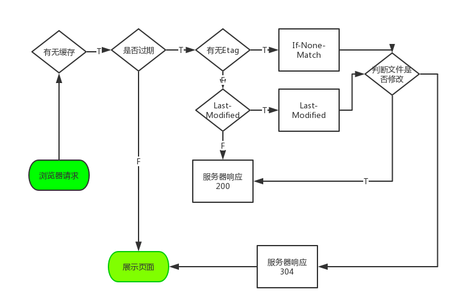
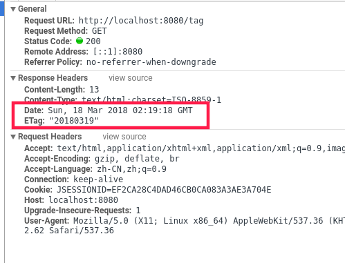
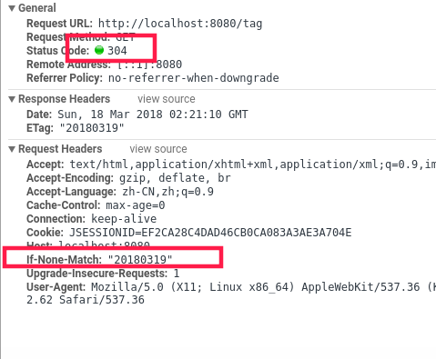
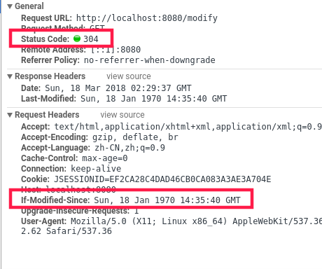

= SpringMVC HTTP缓存
半軔山
:toc: left
:icons: font

== 缓存概述

缓存是一种保存资源副本并在下次请求时直接使用该副本的技术。当 web 缓存发现请求的资源已经被存储，它会拦截请求，返回该资源的拷贝，而不会去源服务器重新下载。这样带来的好处有：缓解服务器端压力，提升性能(获取资源的耗时更短了)。

缓存需要合理配置，因为并不是所有资源都是永久不变的：重要的是对一个资源的缓存应截止到其下一次发生改变（即不能缓存过期的资源）。

== 缓存的分类

缓存的种类有很多,其大致可归为两类：私有与共享缓存。

共享缓存存储的响应能够被多个用户使用。私有缓存只能用于单独用户。本文将主要介绍浏览器与代理缓存，除此之外还有网关缓存、CDN、反向代理缓存和负载均衡器等部署在服务器上，为站点和 web 应用提供更好的稳定性、性能和扩展性。

image:images/HTTPCachtType.png[]

=== (私有)浏览器缓存

私有缓存只能用于单独用户。你可能已经见过浏览器设置中的“缓存”选项。浏览器缓存拥有用户通过 HTTP 下载的所有文档。这些缓存为浏览过的文档提供向后/向前导航，保存网页，查看源码等功能，可以避免再次向服务器发起多余的请求。它同样可以提供缓存内容的离线浏览。

=== (共享)代理缓存
共享缓存可以被多个用户使用。例如，ISP 或你所在的公司可能会架设一个 web 代理来作为本地网络基础的一部分提供给用户。这样热门的资源就会被重复使用，减少网络拥堵与延迟。

== HTTP缓存过程

浏览器缓存包含两种类型，即强缓存（也叫本地缓存）和协商缓存，浏览器在第一次请求发生后，再次请求时：

浏览器在请求某一资源时，会先获取该资源缓存的header信息，判断是否命中强缓存，若命中直接从缓存中获取资源信息，包括缓存header信息；本次请求根本就不会与服务器进行通信；

如果没有命中强缓存，浏览器会发送请求到服务器，请求会携带第一次请求返回的有关缓存的header字段信息（Last-Modified/If-Modified-Since和Etag/If-None-Match），由服务器根据请求中的相关header信息来比对结果是否协商缓存命中；若命中，则服务器返回新的响应header信息更新缓存中的对应header信息，但是并不返回资源内容，它会告知浏览器可以直接从缓存获取；否则返回最新的资源内容

[NOTE] 
====
你可能会觉得使用Last-Modified已经足以让浏览器知道本地的缓存副本是否足够新，为什么还需要Etag呢？

* 一些文件也许会周期性的更改，但是他的内容并不改变(仅仅改变的修改时间)，这个时候我们并不希望客户端认为这个文件被修改了，而重新GET；
* 某些文件修改非常频繁，比如在秒以下的时间内进行修改，(比方说1s内修改了N次)，If-Modified-Since能检查到的粒度是s级的，这种修改无法判断(或者说UNIX记录MTIME只能精确到秒)；
* 某些服务器不能精确的得到文件的最后修改时间。

这时，利用Etag能够更加准确的控制缓存，因为Etag是服务器自动生成或者由开发者生成的对应资源在服务器端的唯一标识符。所以Etag也被称为强校验，与之对应的就是弱校验了

Last-Modified与ETag是可以一起使用的，服务器会优先验证ETag，一致的情况下，才会继续比对Last-Modified，最后才决定是否返回304
====

== Cache-control 头

如果，我们希望客户端缓存页面，可以在响应头中添加该指令，指令的值可以下面的单个值或者多个值的组合：

* no-cache: 从字面意义上很容易误解为不缓存，但是no-cache代表不缓存过期的资源，缓存会向服务器进行有效性确认之后处理资源
* no-store：才是真正的不进行缓存
* must-revalidate:对于客户机的每次请求，代理服务器必须要服务器验证缓存是否过时
* private:只有浏览器可以缓存
* public:浏览器和代理服务器都可以缓存
* max-age=<seconds>:资源被缓存的最长时间
* no-transform:不希望浏览器转码

NOTE: Cache-control出现在请求头中就是用于强缓存和协商缓存。max-age=0表示跳过强缓存，直接进行协商缓存。no-store表示不进行缓存检测，强制请求服务器（相当与谷歌浏览器删除缓存强制刷新）

== Spring MVC的缓存控制

=== 缓存API

Web MVC提供了很多用例和方法为应用程序配置“Cache-Control”头。下面是spring 提供的API

[source,java]
----
 // Cache for an hour - "Cache-Control: max-age=3600"
CacheControl ccCacheOneHour = CacheControl.maxAge(1, TimeUnit.HOURS);

// Prevent caching - "Cache-Control: no-store"
CacheControl ccNoStore = CacheControl.noStore();

// Cache for ten days in public and private caches,
// public caches should not transform the response
// "Cache-Control: max-age=864000, public, no-transform"
CacheControl ccCustom = CacheControl.maxAge(10, TimeUnit.DAYS)
                                    .noTransform().cachePublic();
----

[NOTE] 
====
上面的代码设置缓存过期时间的时候，有几个约定俗成的惯例。

* -1:不生成缓存，不会生成'Cache-Control'响应头
* 0：不生成缓存，生成'Cache-Control: no-store'响应头。
* >0: 缓存 n 秒

====

=== 静态资源

ResourceHttpRequestHandler 用来处理MVC中的静态资源。默认情况下该类会读取文件的元数据返回'Last-Modified'响应头。如果要返回缓存头，需要手动配置

[source,java]
----
@Configuration
@EnableWebMvc
public class WebConfig implements WebMvcConfigurer {

    @Override
    public void addResourceHandlers(ResourceHandlerRegistry registry) {
        registry.addResourceHandler("/resources/**")
                .addResourceLocations("/public-resources/")
                .setCacheControl(CacheControl.maxAge(1, TimeUnit.HOURS).cachePublic());
    }

}
----

[source,xml]
----
<mvc:resources mapping="/resources/**" location="/public-resources/">
    <mvc:cache-control max-age="3600" cache-public="true"/>
</mvc:resources>
----

=== controller中的缓存

控制器可以支持'Cache-Control'，'ETag'and/or'If-Modified-Since'HTTP请求; 如果在响应中设置'Cache-Control'头部，这确实是推荐的。 这包括计算给定请求的lastmodified(long)and/or Etag值，并将其与'If-Modified-Since'请求标头值进行比较，并可能返回状态码为304（未修改）的响应。

下面我们分别来看etag和Last-Modified的例子

*Etag实例*
[source,java]
----
    @GetMapping("/tag")
    public ResponseEntity<String> etag() {
        String content = "this is a tag";
        String etag = "20180319";
        return ResponseEntity.ok().eTag(etag).body(content);
    }
----
第一次请求的结果:

第二次请求的结果:

*Last-Modified实例*
[source,java]
----
    @GetMapping("modify")
    public String last_modify(WebRequest request) {
        long last = 1521340094l;
        boolean b = request.checkNotModified(last);
        if (b) {
            return null;
        }
        return "laast modify";
    }
----

第一次请求的结果:

image:images/modify.png[]

第二次请求的结果:

=== ETag Filter

spring mvc 提供了ShallowEtagHeaderFilter过滤器支持etag功能。ShallowEtagHeaderFilter过滤器通过缓存写入响应的内容并生成一个MD5哈希来创建所谓的ETag值，作为ETag头部响应。 下次客户端发送对相同资源的请求时，它将使用该散列作为If-None-Match值。 过滤器检测到这一点，让请求像往常一样处理，最后比较两个哈希值。 如果它们相等，则返回304。

请注意，此策略可节省网络带宽，但不会节省CPU，因为必须为每个请求计算完整响应。 在上面描述的Controller级别的其他策略可以避免计算。

此过滤器具有writeweakETag参数，用于配置过滤器以写入弱ETag，如下所示：W /“02a2d595e6ed9a0b24f027f2b63b134d6”，

NOTE: ETag有强弱之分。强ETag，不论实体发生多么细微的变化都会改变其值。弱Etag，只有资源发生了根本改变，产生差异时才会改变ETag，弱ETag在字段值最开始处附加W/