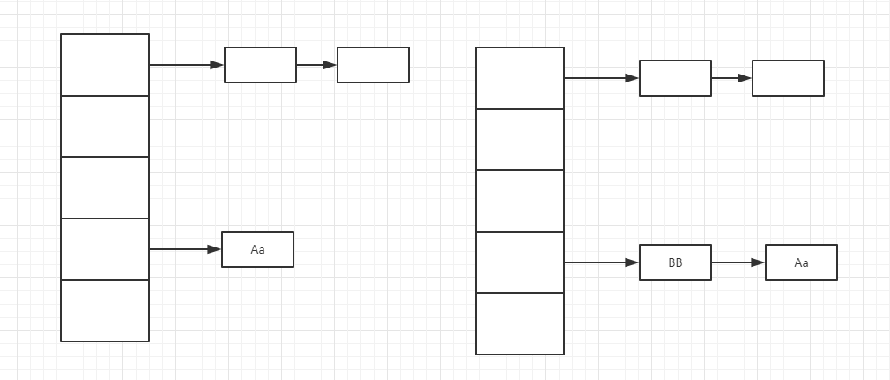

= HashMap深入学习
:toc: left
:icons: font
:sectanchors: 
:toclevels: 4
:source-highlighter: pygments
:pygments-style: manni
:source-linenums-option: 

== JDK1.7的设计

=== 数据存储结构

hashMap的底层存储是以数组加单向列表构成的，请看下图：

image::images/5b61a1560001e8bb06510724.jpg[]

下面我们来看一下类中的关键属性

[source,java]
----
    static final int DEFAULT_INITIAL_CAPACITY = 1 << 4; <1>
    static final int MAXIMUM_CAPACITY = 1 << 30; <2>
    static final float DEFAULT_LOAD_FACTOR = 0.75f; <3>
    transient Entry<K,V>[] table = (Entry<K,V>[]) EMPTY_TABLE; <4>
    transient int size; <5>
    int threshold; <6>
    final float loadFactor; <7>
    transient int modCount; <8>
----

<1>  初始化桶大小，因为底层是数组，所以这是数组默认的大小 
<2>  桶最大值
<3>  默认的负载因子 
<4>  真正存放数据的数组
<5>  Map的大小
<6>  扩容的阀值，当map的大小超过改值的时候，map进行扩容操作
<7>  负载因子。给定的默认容量为 16，负载因子为 0.75。Map 在使用过程中不断的往里面存放数据，当数量达到了 16 * 0.75 = 12 就需要将当前 16 的容量进行扩容，而扩容这个过程涉及到 rehash、复制数据等操作，所以非常消耗性能。因此通常建议能提前预估 HashMap 的大小最好，尽量的减少扩容带来的性能损耗。
<8>  用来记录map的修改。每次对map进行增删改的时候都会增加改值。尤其当遍历map的时候，如果对map进行修改类的操作，会抛出异常ConcurrentModificationException

[source,java]
----
        final Entry<K,V> nextEntry() {
            if (modCount != expectedModCount)
                throw new ConcurrentModificationException();
            Entry<K,V> e = next;
            if (e == null)
                throw new NoSuchElementException();

            if ((next = e.next) == null) {
                Entry[] t = table;
                while (index < t.length && (next = t[index++]) == null)
                    ;
            }
            current = e;
            return e;
        }
----

由上面的代码可以看出，当map进入遍历状态的时候，会保存当前的modCount，如果此时修改map必定导致modCount发生变化，那么遍历过程中就会抛出异常

我们再来看看Entry这个类，他是我们存入map的key-value的载体

[source,java]
----
    static class Entry<K,V> implements Map.Entry<K,V> {
        final K key; <1>
        V value; <2>
        Entry<K,V> next; <3>
        int hash; <4>

        Entry(int h, K k, V v, Entry<K,V> n) {
            value = v;
            next = n;
            key = k;
            hash = h;
        }
----

<1> 写入时的键。
<2> 写入时的值。
<3> 开始的时候就提到 HashMap 是由数组和单向链表组成，所以这个 next 就是用于实现链表结构
<4> 当前 key 的 hashcode

=== 添加值

[source,java]
----
    public V put(K key, V value) {
        if (table == EMPTY_TABLE) { <1>
            inflateTable(threshold);
        }
        if (key == null) <2>
            return putForNullKey(value);
        int hash = hash(key); <3>
        int i = indexFor(hash, table.length);
        for (Entry<K,V> e = table[i]; e != null; e = e.next) { <4>
            Object k;
            if (e.hash == hash && ((k = e.key) == key || key.equals(k))) { <5>
                V oldValue = e.value;
                e.value = value;
                e.recordAccess(this);
                return oldValue;
            }
        }

        modCount++;
        addEntry(hash, key, value, i); <6>
        return null;
    }
----

<1> 判断是否是第一次添加数据，如果是则初始化map
<2> 判断key值是否为空，如果为空，把值放在底层数据的开始位置。另外需要注意，key为null可以多次添加，但是会被覆盖
<3> 计算key的hash值
<4> 遍历链表数据，查看是否有相同的key
<5> 如果key相同，则覆盖旧值并返回
<6> 添加数据，这里需要说明的是，当两个hash值相同的key添加的流程，如下图

=== 获取值

[source,java]
----
    public V get(Object key) {
        if (key == null)
            return getForNullKey();
        Entry<K,V> entry = getEntry(key);

        return null == entry ? null : entry.getValue();
    }

    final Entry<K,V> getEntry(Object key) {
        if (size == 0) {
            return null;
        }

        int hash = (key == null) ? 0 : hash(key);
        for (Entry<K,V> e = table[indexFor(hash, table.length)];
             e != null;
             e = e.next) {
            Object k;
            if (e.hash == hash &&
                ((k = e.key) == key || (key != null && key.equals(k))))
                return e;
        }
        return null;
    }
----

首先也是根据 key 计算出 hashcode，然后定位到具体的桶中。判断该位置是否为链表。不是链表就根据 key、key 的 hashcode 是否相等来返回值。为链表则需要遍历直到 key 及 hashcode 相等时候就返回值。啥都没取到就直接返回 null 。

== JDK1.8的设计

不知道 1.7 的实现大家看出需要优化的点没有？其实一个很明显的地方就是：当 Hash 冲突严重时，在桶上形成的链表会变的越来越长，这样在查询时的效率就会越来越低；时间复杂度为 O(N)。因此 1.8 中重点优化了这个查询效率。

=== 数据存储结构

image::images/5b61a15800019c3107730437.jpg[]

[source,java]
----
    static final int DEFAULT_INITIAL_CAPACITY = 1 << 4; // aka 16
    static final int MAXIMUM_CAPACITY = 1 << 30;
    static final float DEFAULT_LOAD_FACTOR = 0.75f;
    static final int TREEIFY_THRESHOLD = 8;
    static final int UNTREEIFY_THRESHOLD = 6;
    static final int MIN_TREEIFY_CAPACITY = 64;
	transient Node<K,V>[] table;
    transient int size;
    transient int modCount;
    int threshold;
    final float loadFactor;

----

和 1.7 大体上都差不多，还是有几个重要的区别：

. TREEIFY_THRESHOLD 用于判断是否需要将链表转换为红黑树的阈值。
. Entry 修改为 Node。

=== 添加值

[source,java]
----
 	public V put(K key, V value) {
        return putVal(hash(key), key, value, false, true);
    }

   
    final V putVal(int hash, K key, V value, boolean onlyIfAbsent,
                   boolean evict) {
        Node<K,V>[] tab; Node<K,V> p; int n, i;
        if ((tab = table) == null || (n = tab.length) == 0) <1>
            n = (tab = resize()).length;
        if ((p = tab[i = (n - 1) & hash]) == null) <2>
            tab[i] = newNode(hash, key, value, null);
        else {
            Node<K,V> e; K k;
            if (p.hash == hash &&
                ((k = p.key) == key || (key != null && key.equals(k)))) <3>
                e = p;
            else if (p instanceof TreeNode) <4>
                e = ((TreeNode<K,V>)p).putTreeVal(this, tab, hash, key, value);
            else { <5>
                for (int binCount = 0; ; ++binCount) { 
                    if ((e = p.next) == null) { 
                        p.next = newNode(hash, key, value, null);
                        if (binCount >= TREEIFY_THRESHOLD - 1) 
                            treeifyBin(tab, hash);
                        break;
                    }
                    if (e.hash == hash &&
                        ((k = e.key) == key || (key != null && key.equals(k))))
                        break;
                    p = e;
                }
            }
            if (e != null) { <6>
                V oldValue = e.value;
                if (!onlyIfAbsent || oldValue == null)
                    e.value = value;
                afterNodeAccess(e);
                return oldValue;
            }
        }
        ++modCount;
        if (++size > threshold)
            resize();
        afterNodeInsertion(evict);
        return null;
    }

----

<1> 如果是初次添加，需要初始化map
<2> #(n - 1) & hash# 计算在数组中的索引，如果该位置的值为空，则直接添加
<3> 如果当前桶有值（ Hash 冲突），那么就要比较当前桶中的 key、key 的 hashcode 与写入的 key 是否相等，相等就赋值给 e,在第6步的时候会统一进行赋值及返回
<4> 如果hash索引到的是树节点，执行添加操作
<5> 如果hash索引到的是链表，执行添加并校验链表长度是否达到预设的阈值，达到则转化成红黑树
<6> 如果 e != null 就相当于存在相同的 key,那就需要将值覆盖。并返回旧值

=== 获取值

[source,java]
----
    final Node<K,V> getNode(int hash, Object key) {
        Node<K,V>[] tab; Node<K,V> first, e; int n; K k;
        if ((tab = table) != null && (n = tab.length) > 0 &&
            (first = tab[(n - 1) & hash]) != null) {
            if (first.hash == hash && // always check first node
                ((k = first.key) == key || (key != null && key.equals(k))))
                return first;
            if ((e = first.next) != null) {
                if (first instanceof TreeNode)
                    return ((TreeNode<K,V>)first).getTreeNode(hash, key);
                do {
                    if (e.hash == hash &&
                        ((k = e.key) == key || (key != null && key.equals(k))))
                        return e;
                } while ((e = e.next) != null);
            }
        }
        return null;
    }
----

get 方法看起来就要简单许多了。首先将 key hash 之后取得所定位的桶。如果桶为空则直接返回 null 。否则判断桶的第一个位置(有可能是链表、红黑树)的 key 是否为查询的 key，是就直接返回 value。如果第一个不匹配，则判断它的下一个是红黑树还是链表。红黑树就按照树的查找方式返回值。不然就按照链表的方式遍历匹配返回值。

== Collections.synchronizedMap
[source,java]
----
   public static <K,V> Map<K,V> synchronizedMap(Map<K,V> m) {
        return new SynchronizedMap<>(m);
    }

    private static class SynchronizedMap<K,V>
        implements Map<K,V>, Serializable {
        private static final long serialVersionUID = 1978198479659022715L;

        private final Map<K,V> m;     // Backing Map
        final Object      mutex;        // Object on which to synchronize

        SynchronizedMap(Map<K,V> m) {
            this.m = Objects.requireNonNull(m);
            mutex = this;
        }

        SynchronizedMap(Map<K,V> m, Object mutex) {
            this.m = m;
            this.mutex = mutex;
        }

        public int size() {
            synchronized (mutex) {return m.size();}
        }
        ....
----

synchronizedMap返回一个新的map对象，该map对象上对所有方法做了同步。

== HashTable和HashMap 

两者实现的方法几乎一样，但是HashTable上全是同步方法。