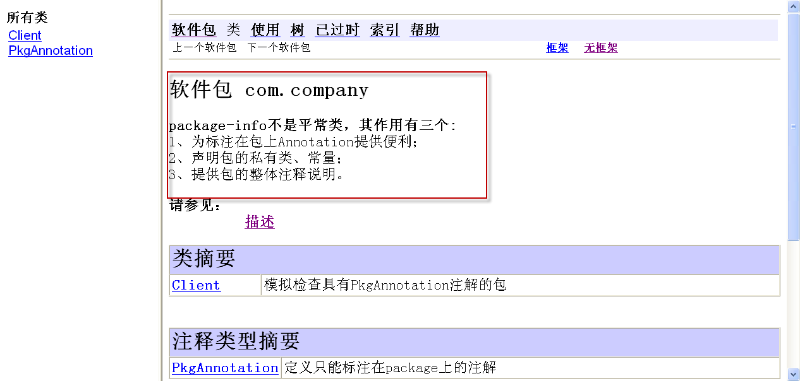

#1.概述
pacakge-info.java文件主要用来描述和记录本包信息.他在eclipse是不能被创建的(类命名不能包含"-"特殊字符),必须在外部创建之后复制进项目当中.
#2.作用
##1、为标注在包上Annotation提供便利.
1.定义注解类

````
/** 
 * 定义只能标注在package上的注解 
*/  
@Target(ElementType.PACKAGE)  
@Retention(RetentionPolicy.RUNTIME)  
public @interface PkgAnnotation {  
}  
````

2.定义一个package-info类
````
@PkgAnnotation  
package com.company;
````

##2、声明友好类和包常量.

这个比较简单，而且很实用，比如一个包中有很多的内部访问的类或常量，就可以统一的放到package-info类中，这样就方便，而且集中管理，减少friendly类到处游走的情况，看例子：
````
@PkgAnnotation  
package com.company;  
 //这里是包类，声明一个包使用的公共类，强调的是包访问权限  
class PkgClass{  
    public void test(){  
    }  
}  
//包常量，只运行包内访问，适用于分“包”开发  
class PkgConst{  
    static final Str![][]ing PACAKGE_CONST="ABC";  
}  
````
##3、提供包的整体注释说明。
如果是分“包”开发，也就是说一个包实现一个业务逻辑或功能点、或模块、或组件，则需要对一个包有很好的说明，说明这个包是干啥的，有啥作用，版本变迁，特别说明等等，如下：
````
/** 
 * <b>package-info不是平常类，其作用有三个:</b><br> 
 * 1、为标注在包上Annotation提供便利；<br> 
 * 2、声明包的私有类和常量；<br> 
 * 3、提供包的整体注释说明。<br>  
*/  
package com.company;  
````
生成文档如下:


