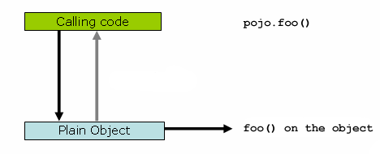

 = spring 面向切面编程

:toc: left
:icons: font

== spring面向切面编程

=== 5.1. 简介

面向切面编程（AOP）通过提供关于程序结构的另一种思路来补充面向对象编程（OOP）。OOP模块化的关键单元是类，而在AOP中，模块化的单元是切面。切面使关注（concerns）的模块化成为可能，例如跨越多种类型和对象的事务管理。（AOP文献中常常将这种关注称为横切关注点。）

AOP框架是Spring的关键组件之一。spring-ioc容器并不依赖aop,也就是说你可以根据需要决定在项目中是否使用AOP。AOP是Spring IoC的补充，可提供非常强大的中间件解决方案。

spring aop框架主要的用处：

* 提供声明性企业服务,特别是作为EJB声明式服务的替代品.例如声明式事务管理。
* 允许用户实现自定义切面，补充OOP。

==== 5.1.1. AOP 概念

让我们从定义一些核心的aop概念和术语开始。这些术语不是Spring特有的。不幸的是，AOP术语并不是特别直观，然而，如果Spring使用自己的术语，那将更加令人困惑。

* Aspect：跨越多个类的关注模块化。事务管理是企业Java应用程序中横切关注的一个很好的例子。在Spring AOP中，aspects是使用常规类（基于模式的方法）或使用@Aspect注释（@AspectJ样式）注释的常规类来实现的。
* Join point:在程序执行期间的一个点，如执行方法或处理异常。在Spring AOP中，join point总是表示方法的执行。
* Advice: Aspect在特定join point采取的行动。不同的类型的advice包括"around"、"before"和"after"。包括Spring在内的许多AOP框架都将建议advice称为拦截器，在join point周围维护一系列拦截器。

* Pointcut: 匹配join points的谓词。Advice关联pointcut表达式，在由pointcut匹配的任何连接点处运行（例如，执行具有某个名称的方法）。与切入点表达式匹配的连接点的概念是AOP的核心，Spring默认使用AspectJ切入点表达式语言
* Introduction:代表类型声明其他方法或字段.Spring AOP允许您为任何被通知（advised）的对象引入新的接口（和相应的实现）。例如，您可以使用Introduction来使bean实现IsModified接口，以简化缓存。(在AspectJ社区中，Introduction被称为类型内声明)

* Target object:对象被一个或多个切面通知，也被称为通知对象。由于Spring AOP是使用运行时代理实现的，因此此对象总被成为代理对象
* Weaving:将切面与其他应用程序类型或对象链接以创建一个通知对象。这可以在编译时（例如使用AspectJ编译器），加载时或运行时完成。 像其他纯Java AOP框架一样，Spring AOP在运行时执行Weaving。

advice的种类：
* Before advice[前置通知]：在连接点之前执行的通知，但无法阻止执行流程继续到连接点（除非它引发异常）
* After returning advice[后置通知]:在连接点正常完成后要执行的通知：例如，如果方法返回而没有抛出异常。
* After throwing advice[异常通知]:如果方法通过抛出异常退出，则要执行的通知。
* After (finally) advice[最终通知]:无论连接点退出的方式（正常或特殊返回）,都会执行的通知。
* Around advice[环绕通知]:围绕连接点的通知，如方法调用。这是最强有力的通知。他可以在方法调用之前和之后执行自定义行为。它还负责选择是继续执行连接点还是通过返回其自己的返回值或抛出异常来快速中止通知的方法执行。

环绕通知是最普遍的通知。虽然Spring AOP与AspectJ一样提供了全面的通知类型，但是我们建议您使用能够实现所需行为的功能最低的通知类型。例如，如果只需要使用方法的返回值来更新缓存，则最好是实现后置通知而不是环绕通知，尽管环绕通知可以完成同样的事情。使用最具体的通知类型提供了一个更简单的编程模型，出错的可能性较小。

在Spring 2.0中，所有通知参数都是静态类型的，因此您可以使用适当类型的通知参数（例如来自方法执行的返回值的类型）而不是对象数组。

连接点的概念，与切入点相匹配，是AOP的关键，它将它与只提供拦截的旧技术区分开来.切入点使通知可以独立于面向对象的层次结构进行设定。例如，提供声明性事务管理的around通知可以应用于跨越多个对象的一组方法（如服务层中的所有业务操作）。

==== 5.1.2. Spring AOP的功能和目标

Spring AOP在纯Java中实现。不需要特殊的编译过程。Spring AOP不需要控制类加载器层次结构，因此适用于Servlet容器或应用程序服务器。

Spring AOP目前仅支持在方法上构建连接点.feild拦截没有实现，虽然可以在不破坏核心Spring AOP API的情况下添加field拦截的支持。如果您需要通知字段访问和更新的连接点，请考虑AspectJ等语言。

Spring AOP的AOP方法与大多数其他AOP框架不同。 目标不是提供最完整的AOP实现（尽管Spring AOP的功能非常强大）;而是在AOP实现和Spring IoC之间提供紧密集成，以帮助解决企业应用程序中的常见问题。

因此，例如，Spring框架的AOP功能通常与Spring IoC容器一起使用。切面使用正常的bean定义语法进行配置（尽管这允许强大的“自动代理”功能），这是与其他AOP实现的关键区别。有些事情你不能轻易或高效地使用Spring AOP，比如通知非常细粒度的对象（例如域对象），AspectJ是这种情况下的最佳选择。但是，我们的经验是，Spring AOP为适用于AOP的企业Java应用程序中的大多数问题提供了极好的解决方案。

Spring AOP永远不会与AspectJ竞争提供全面的AOP解决方案。我们认为像Spring AOP这样的基于代理的框架和像AspectJ这样的全面框架都是有价值的，它们是互补的，而不是竞争。Spring将Spring AOP和IoC与AspectJ无缝集成，以便在基于Spring的一致应用程序体系结构中满足AOP的所有用途。此集成不影响Spring AOP API或AOP Alliance API：Spring AOP仍保持向后兼容。 有关Spring AOP API的讨论，请参阅以下章节。

==== 5.1.3. AOP代理
Spring AOP默认使用标准的JDK动态代理作为AOP代理。 这使得任何接口（或一组接口）都可以被代理。如果业务对象没有实现接口，则缺省使用CGLIB。面向接口编程相比与面向类是一种更好的实践。业务类通常会实现一个或多个业务接口。

Spring AOP也可以使用CGLIB代理。这对代理类而言，接口不是必需的。在需要通知未在接口中声明的方法的情况下，或者需要将代理对象作为具体类型传递给方法的情况下（希望很少），可以强制使用CGLIB。

掌握Spring AOP是基于代理的事实是很重要的。 请参阅了解AOP代理[lj]以彻底检查此实现细节的实际含义。

=== 5.2. @AspectJ 支持
@AspectJ将切面声明为常规的被注解的Java类。AspectJ项目引入了@AspectJ风格，作为AspectJ 5版本的一部分。Spring使用AspectJ提供的用于切入点解析和匹配的库来解释与AspectJ 5相同的注释。AOP运行时仍然是纯粹的Spring AOP，并且不依赖于AspectJ编译器或编织器。

==== 5.2.1. 启动@AspectJ支持
要在Spring配置中使用@AspectJ切面，您需要启用Spring支持，并根据这些切面设置是否对bean进行自动代理。autoproxying的意思是说，如果Spring确定bean被一个或多个切面通知，它会自动生成一个该bean的代理来拦截方法调用并确保根据需要执行这个advice。
可以使用XML或Java风格配置启用@AspectJ支持。无论哪种情况，您还需要确保AspectJ的aspectjweaver.jar库位于应用程序的类路径中（版本1.8或更高版本）。 该库可在AspectJ发行版的'lib'目录中或通过Maven Central存储库获得。

===== java配置中启动@AspectJ支持
要使用Java @Configuration启用@AspectJ支持，请添加@EnableAspectJAutoProxy注释：
[source,java]
----
@Configuration
@EnableAspectJAutoProxy
public class AppConfig {

}
----
===== XML配置中启动@AspectJ支持
要在基于XML的配置启用@AspectJ支持，请使用AOP:AspectJ AutoService元素：
----
<aop:aspectj-autoproxy/>
----

==== 5.2.2. 声明aspect

在启用@AspectJ支持的情况下，在您的应用程序上下文中定义的任何具有@AspectJ的类,具有@Aspect注释的bean将被Spring自动检测到并用于配置Spring AOP。 以下示例显示了一个不太有用的切面所需的最小定义：

应用程序上下文中的常规bean定义，指向具有@Aspect注释的bean类：
----
<bean id="myAspect" class="org.xyz.NotVeryUsefulAspect">
    <!-- configure properties of aspect here as normal -->
</bean>
----
[source,java]
----
package org.xyz;
import org.aspectj.lang.annotation.Aspect;

@Aspect
public class NotVeryUsefulAspect {

}
----
切面（用@Aspect注解的类）可能像任何其他类一样具有方法和字段。 它们也可能包含pointcut, advice和introduction (inter-type)声明。

NOTE: 在Spring AOP中，不可能将切面本身作为其他切面的通知的目标。类中的@Aspect注释将其标记为一个切面，因此将其从自动代理中排除。

==== 5.2.3. 声明pointcut

回想一下，切入点决定了感兴趣的连接点，从而使我们能够控制何时执行通知。Spring AOP仅支持Spring bean的方法执行连接点，因此您可以将切入点视为匹配Spring Bean上方法的执行。切入点声明包含两部分：包含名称和任何参数的签名以及确切地确定我们感兴趣的方法执行的切入点表达式。在AOP的@AspectJ注释样式中，通过常规方法定义提供切入点签名，并且使用@Pointcut注释指示切入点表达式（用作切入点签名的方法必须具有void返回类型）。

一个例子将帮助区分切入点签名和切入点表达式之间的区别。以下示例定义了名为'anyOldTransfer'的切入点，该切入点将与名为'transfer'的任何方法的执行相匹配：
[source,java]
----
@Pointcut("execution(* transfer(..))")// the pointcut expression
private void anyOldTransfer() {}// the pointcut signature
----
构成@Pointcut注释值的切入点表达式是一个常规的AspectJ 5切入点表达式。

===== 支持的切入点指示符
Spring AOP支持以下用于切入点表达式的AspectJ切入点指示符（PCD）：

* execution:匹配方法执行连接点，这是您在使用Spring AOP时将使用的主要切入点指示符
* within:限制匹配某些类型内的连接点（只需执行使用Spring AOP时在匹配类型中声明的方法）
* this:限制与连接点的匹配（在使用Spring AOP时执行方法），其中bean引用（Spring AOP代理）是给定类型的一个实例
* target:限制与连接点的匹配（在使用Spring AOP时执行方法）目标对象（被代理的应用程序对象）是给定类型的实例
* args:限制匹配连接点（使用Spring AOP时执行方法），其中参数是给定类型的实例
* @target:限制匹配连接点（使用Spring AOP时执行方法），其中执行对象的类具有给定类型的注释
* @args:限制与连接点的匹配（使用Spring AOP时的方法执行），其中传递的实际参数的运行时类型具有给定类型的注释
* @within  - 在给定注释的类型内限制匹配连接点（在使用Spring AOP时执行使用给定注释的类型中声明的方法）
* @annotation  - 限制匹配连接点的位置（在Spring AOP中执行的方法）有给定的注释

因为Spring AOP将匹配限制为只有方法执行连接点，所以上面讨论的切入点指示符给出的定义比您在AspectJ编程指南中找到的要窄。另外，AspectJ本身具有基于类型的语义，并且在执行连接点上，this和target都指向同一个对象 - 执行该方法的对象。 Spring AOP是一个基于代理的系统，它区分代理对象本身（绑定到此）和代理（绑定到目标）后面的目标对象。

Spring AOP还支持额外的PCD命名bean。 此PCD允许您限制连接点与特定命名的Spring bean或一组命名的Spring bean（使用通配符时）的匹配。 bean PCD具有以下形式：
----
bean(idOrNameOfBean)
----
idOrNameOfBean标记可以是任何Spring bean的名称：提供了使用*字符的有限通配符支持，因此如果您为Spring bean建立了一些命名约定，则可以很容易地编写一个bean PCD表达式来将其选出。 与其他切入点指示符的情况一样，bean PCD可以被&&、||、!。

===== 结合切入点表达式
切点表达式可以被'&&', '||' and '!'连接。也可以通过名称来引用切入点表达式。 以下示例显示了三个切入点表达式：anyPublicOperation（如果方法执行连接点表示执行任何公共方法，则匹配）;inTrading（如果交易模块中有执行方法，则匹配），和tradingOperation（如果方法执行表示交易模块中的任何公共方法，则匹配）。
[source,java]
----
@Pointcut("execution(public * *(..))")
private void anyPublicOperation() {}

@Pointcut("within(com.xyz.someapp.trading..*)")
private void inTrading() {}

@Pointcut("anyPublicOperation() && inTrading()")
private void tradingOperation() {}
----

如上所示，使用较小的命名组件构建更复杂的切入点表达式是一种最佳做法。当按名称引用切入点时，将应用普通的Java可见性规则（您可以看到相同类型中private切入点，类层次结构中的protected切入点，任何地方的public切入点等）。 可见性不影响切入点匹配。

===== 共享通用切入点定义

在使用企业应用程序时，您通常希望从几个方面参考应用程序的模块和特定操作集。 我们建议定义一个“SystemArchitecture”切面来捕获常见的切入点表达式。 典型的这一方面如下所示：
[source,java]
----
package com.xyz.someapp;

import org.aspectj.lang.annotation.Aspect;
import org.aspectj.lang.annotation.Pointcut;

@Aspect
public class SystemArchitecture {

    /**
     * A join point is in the web layer if the method is defined
     * in a type in the com.xyz.someapp.web package or any sub-package
     * under that.
     */
    @Pointcut("within(com.xyz.someapp.web..*)")
    public void inWebLayer() {}

    /**
     * A join point is in the service layer if the method is defined
     * in a type in the com.xyz.someapp.service package or any sub-package
     * under that.
     */
    @Pointcut("within(com.xyz.someapp.service..*)")
    public void inServiceLayer() {}

    /**
     * A join point is in the data access layer if the method is defined
     * in a type in the com.xyz.someapp.dao package or any sub-package
     * under that.
     */
    @Pointcut("within(com.xyz.someapp.dao..*)")
    public void inDataAccessLayer() {}

    /**
     * A business service is the execution of any method defined on a service
     * interface. This definition assumes that interfaces are placed in the
     * "service" package, and that implementation types are in sub-packages.
     *
     * If you group service interfaces by functional area (for example,
     * in packages com.xyz.someapp.abc.service and com.xyz.someapp.def.service) then
     * the pointcut expression "execution(* com.xyz.someapp..service.*.*(..))"
     * could be used instead.
     *
     * Alternatively, you can write the expression using the 'bean'
     * PCD, like so "bean(*Service)". (This assumes that you have
     * named your Spring service beans in a consistent fashion.)
     */
    @Pointcut("execution(* com.xyz.someapp..service.*.*(..))")
    public void businessService() {}

    /**
     * A data access operation is the execution of any method defined on a
     * dao interface. This definition assumes that interfaces are placed in the
     * "dao" package, and that implementation types are in sub-packages.
     */
    @Pointcut("execution(* com.xyz.someapp.dao.*.*(..))")
    public void dataAccessOperation() {}

}
----
在这个切面定义的切入点可以在任何需要切入点表达式的地方引用。 例如，要使服务层事务化，您可以编写：
[source,xml]
----
<aop:config>
    <aop:advisor
        pointcut="com.xyz.someapp.SystemArchitecture.businessService()"
        advice-ref="tx-advice"/>
</aop:config>

<tx:advice id="tx-advice">
    <tx:attributes>
        <tx:method name="*" propagation="REQUIRED"/>
    </tx:attributes>
</tx:advice>
----
在基于模式的AOP支持中讨论<aop：config>和<aop：advisor>元素。 事务管理中讨论了事务元素。

===== 示例
Spring AOP用户可能最常使用执行切入点指示符。 执行表达式的格式是：
----
execution(modifiers-pattern? ret-type-pattern declaring-type-pattern?name-pattern(param-pattern)
            throws-pattern?)
----
除了返回类型模式（上面代码片段中的ret-type-pattern），名称模式和参数模式以外的所有部分都是可选的。返回类型模式确定方法的返回类型必须是什么，才能匹配连接点。大多数情况下，您将使用*作为返回类型模式，它与任何返回类型匹配。只有当方法返回给定类型时，完全限定类型名称才会匹配。名称模式与方法名称匹配。您可以将*通配符用作全部或部分名称模式。如果指定一个声明类型模式，则包含尾部.将其加入名称模式组件。参数模式稍微复杂一点：（）匹配不带参数的方法，而（..）匹配任意数量的参数（零个或多个）。 模式（*）匹配任何类型的一个参数的方法，（*，String）匹配一个采用两个参数的方法，第一个可以是任何类型，第二个必须是字符串。

常见切入点表达式的一些示例如下所示。

执行任何公共方法：
----
execution(public * *(..))
----

执行名称以“set”开头的任何方法：
----
execution(* set*(..))
----

执行由AccountService接口定义的任何方法：
----
execution(* com.xyz.service.AccountService.*(..))
----

执行服务包中定义的任何方法：
----
execution(* com.xyz.service.*.*(..))
----

执行服务包或子包中定义的任何方法：
----
execution(* com.xyz.service..*.*(..))
----

服务包中的任何连接点（仅在Spring AOP中执行的方法）：
----
within(com.xyz.service.*)
----

服务包或子包中的任何连接点（仅在Spring AOP中执行的方法）：
----
within(com.xyz.service..*)
----

代理实现AccountService接口的任何连接点（仅在Spring AOP中执行的方法）：
----
this(com.xyz.service.AccountService)
----

目标对象实现AccountService接口的任何连接点（只在Spring AOP中执行的方法）：
----
target(com.xyz.service.AccountService)
----

任何只接受一个参数的连接点（只在Spring AOP中执行的方法）以及在运行时传递的参数是Serializable：
----
args(java.io.Serializable)
----

NOTE: 此示例中给出的切入点与执行不同（* *（java.io.Serializable））：如果在运行时传递的参数是Serializable，则args版本会匹配，如果方法签名声明单个参数为类型Serializable,execution会匹配。

任何目标对象具有@Transactional注释的连接点（只在Spring AOP中执行的方法）：
----
@target(org.springframework.transaction.annotation.Transactional)
----

任何连接点（仅在Spring AOP中执行的方法），其中目标对象的声明类型具有@Transactional注释：
----
@within(org.springframework.transaction.annotation.Transactional)
----

任何连接点（只在Spring AOP中执行的方法）执行方法有@Transactional注解的地方：
----
@annotation(org.springframework.transaction.annotation.Transactional)
----

任何连接点（只在Spring AOP中执行的方法）接受一个参数，并且传递的参数的运行时类型具有@Classified注释：
----
@args(com.xyz.security.Classified)
----

名为tradeService的Spring bean上的任何连接点（仅在Spring AOP中执行的方法）：
----
bean(tradeService)
----

对于名称与通配符表达式匹配的Spring bean（仅在Spring AOP中执行的方法）：
----
bean(*Service)
----

===== 编写好的切入点
在编译期间，AspectJ会处理切入点以试图优化匹配性能.检查代码并确定每个连接点是否匹配（静态或动态）给定的切入点是一个代价高昂的过程(动态匹配意味着无法从静态分析完全确定匹配，并且将在代码中放置一个测试以确定代码运行时是否存在实际匹配)。在第一次遇到切入点声明时，AspectJ会将其重写为匹配过程的最佳形式。这是什么意思？基本上，切入点被重写为DNF（析取范式），并且切入点的组件被分类，以便首先检查那些评估更便宜的组件。这意味着您不必担心理解各种切入点指示符的性能，并且可能会在切入点声明中以任何顺序提供它们。

但是，AspectJ只能使用它所说的内容，并且为了获得最佳匹配性能，您应该考虑它们尝试实现的目标，并尽可能缩小匹配的搜索空间。 现有的指定者自然属于三个群体之一：kinded, scoping and context：

* kinded指定符是那些选择特定类型的连接点的指定符。 例如：执行，获取，设置，调用，处理程序.
* scoping指定符是指选择一组感兴趣的连接点（可能是多种连接点）的指定符。 例如：within, withincode
* 上下文指示符是基于上下文匹配（并可选地绑定）的那些指示符。 例如：this，target，@annotation

一个写得好的切入点应至少包括前两种类型（kinded和scoping），而如果希望基于连接点上下文进行匹配，则可以包含上下文指示符，或者将该上下文绑定以用于通知。只需提供一个指定的指示符或仅指定一个上下文指示符即可使用，但可能会因所有额外的处理和分析而影响编织性能（使用的时间和内存）,scoping标识符的匹配速度非常快，而且它们的使用方式意味着AspectJ可以快速解除不应该进一步处理的连接点组 - 这就是为什么一个好的切入点应该总是包含一个可能的原因。

==== 5.2.4. 声明advice
建议与切入点表达式相关联，并且在切入点匹配的方法执行之前，之后或环绕运行。切入点表达式可以是对命名切入点的简单引用，也可以是就地声明的切入点表达式。

===== 前置通知

前置通知使用@Before
[source,java]
----
import org.aspectj.lang.annotation.Aspect;
import org.aspectj.lang.annotation.Before;

@Aspect
public class BeforeExample {

    @Before("com.xyz.myapp.SystemArchitecture.dataAccessOperation()")
    public void doAccessCheck() {
        // ...
    }

}
----

如果使用就地切入点表达式，我们可以将上面的示例重写为：
[source,java]
----
import org.aspectj.lang.annotation.Aspect;
import org.aspectj.lang.annotation.Before;

@Aspect
public class BeforeExample {

    @Before("execution(* com.xyz.myapp.dao.*.*(..))")
    public void doAccessCheck() {
        // ...
    }

}
----

===== 后置通知
在匹配的方法执行正常返回时返回触发后置通知。 它使用@AfterReturning注释声明：
[source,java]
----
import org.aspectj.lang.annotation.Aspect;
import org.aspectj.lang.annotation.AfterReturning;

@Aspect
public class AfterReturningExample {

    @AfterReturning("com.xyz.myapp.SystemArchitecture.dataAccessOperation()")
    public void doAccessCheck() {
        // ...
    }

}
----

有时您需要在通知主体中访问返回的实际值。 你可以使用@AfterReturning的形式来绑定这个返回值：
[source,java]
----
@Aspect
public class AfterReturningExample {

    @AfterReturning(
        pointcut="com.xyz.myapp.SystemArchitecture.dataAccessOperation()",
        returning="retVal")
    public void doAccessCheck(Object retVal) {
        // ...
    }

}
----

返回属性中使用的名称必须与通知方法中参数的名称相对应。 当方法执行返回时，返回值将作为相应的参数值传递给通知方法。 返回子句还将匹配限制为仅返回指定类型的值的方法执行（本例中为Object，它将与任何返回值相匹配）。

===== 异常通知

异常通知使用@AfterThrowing
[source,java]
----
import org.aspectj.lang.annotation.Aspect;
import org.aspectj.lang.annotation.AfterThrowing;

@Aspect
public class AfterThrowingExample {

    @AfterThrowing("com.xyz.myapp.SystemArchitecture.dataAccessOperation()")
    public void doRecoveryActions() {
        // ...
    }

}
----

通常，只有在抛出给定类型的异常时才需要通知运行，并且通常还需要访问通知主体中抛出的异常。使用throwing属性来限制匹配（如果需要，请使用Throwable作为异常类型）并将抛出的异常绑定到advice参数。
[source,java]
----
import org.aspectj.lang.annotation.Aspect;
import org.aspectj.lang.annotation.AfterThrowing;

@Aspect
public class AfterThrowingExample {

    @AfterThrowing(
        pointcut="com.xyz.myapp.SystemArchitecture.dataAccessOperation()",
        throwing="ex")
    public void doRecoveryActions(DataAccessException ex) {
        // ...
    }

}
----

throwing属性中使用的名称必须与通知方法中的参数名称相对应。当方法执行通过抛出异常退出时，异常将作为相应的参数值传递给advice方法。 throwing子句也会将匹配限制为仅引发抛出指定类型的异常的方法执行（本例中为DataAccessException）。

=====　最终通知

在（最后）通知运行后，匹配的方法执行退出。 它使用@After注释声明。 通知无论是在方法正常执行还是抛出异常都会执行。 它通常用于释放资源等。
[source,java]
----
import org.aspectj.lang.annotation.Aspect;
import org.aspectj.lang.annotation.After;

@Aspect
public class AfterFinallyExample {

    @After("com.xyz.myapp.SystemArchitecture.dataAccessOperation()")
    public void doReleaseLock() {
        // ...
    }

}
----

===== 环绕通知
环绕通知控制匹配的方法执行。 它控制在方法执行之前和之后进行工作，并确定方法实际上何时，如何，甚至是否实际上执行。
如果您需要以线程安全的方式（例如启动和停止计时器）在方法执行之前和之后共享状态，则通常会使用环绕通知。始终使用符合您要求的最不强大的建议形式（即，如果前置通知可以使用，就不要使用环绕通知）。

环绕通知是使用@Around注释声明的。 通知方法的第一个参数必须是ProceedingJoinPoint类型。在通知的主体中，ProceedingJoinPoint调用proceed（）会控制切点的方法执行。 proceed方法也可传递Object []参数  - 数组中的值将用作切点方法执行的参数。
[source,java]
----
import org.aspectj.lang.annotation.Aspect;
import org.aspectj.lang.annotation.Around;
import org.aspectj.lang.ProceedingJoinPoint;

@Aspect
public class AroundExample {

    @Around("com.xyz.myapp.SystemArchitecture.businessService()")
    public Object doBasicProfiling(ProceedingJoinPoint pjp) throws Throwable {
        // start stopwatch
        Object retVal = pjp.proceed();
        // stop stopwatch
        return retVal;
    }

}
----

===== 通知参数
Spring提供完全类型化的通知- 意味着您在通知签名中声明了所需的参数（正如我们对上面的返回和抛出示例所见），而不是始终使用Object[]数组。我们将立即看到如何使通知使用参数和其他上下文值。 首先让我们看看如何编写通用通知，以便了解通知目前建议的方法。

*访问当前的JoinPoint*
任何通知方法都可以声明为org.aspectj.lang.JoinPoint类型的参数作为其第一个参数（请注意，需要around通知才能声明ProceedingJoinPoint类型的第一个参数，它是JoinPoint的子类.JoinPoint接口提供了许多有用的方法，例如getArgs（）（返回方法参数），getThis（）（返回代理对象），getTarget（）（返回目标对象），getSignature（）（返回被通知的）和toString（）（打印一个有用的方法描述)。

*将参数传递给建议*
我们已经看到了如何绑定返回的值或异常值（在返回后和抛出建议后使用）。要使参数值可用于通知主体，您可以使用args的绑定形式。如果在args表达式中使用参数名称代替类型名称，则在调用通知时，相应参数的值将作为参数值传递。
[source,java]
----
@Before("com.xyz.myapp.SystemArchitecture.dataAccessOperation() && args(account,..)")
public void validateAccount(Account account) {
    // ...
}
----
切入点表达式的args（account，..）部分有两个目的：首先，它将匹配限制为只有那些方法至少需要一个参数的方法执行，并且传递给该参数的参数是Account的一个实例; 其次，它通过account参数使实际的帐户对象可用于通知。

另一种编写这种方法的方式是声明一个切入点，该切入点在与连接点相匹配时“提供”Account对象值，然后仅从通知中引用指定的切入点。 这看起来如下所示：
[source,java]
----
@Pointcut("com.xyz.myapp.SystemArchitecture.dataAccessOperation() && args(account,..)")
private void accountDataAccessOperation(Account account) {}

@Before("accountDataAccessOperation(account)")
public void validateAccount(Account account) {
    // ...
}
----
代理对象（this），目标对象（target）和注释（@within，@target，@annotation，@args）都可以以类似的方式绑定。 以下示例显示如何匹配用@Auditable批注注释的方法的执行情况。

首先定义@Auditable注释：
[source,java]
----
@Retention(RetentionPolicy.RUNTIME)
@Target(ElementType.METHOD)
public @interface Auditable {
    AuditCode value();
}
----

然后是与@Auditable方法的执行相匹配的通知：
[sourcee,java]
----
@Before("com.xyz.lib.Pointcuts.anyPublicMethod() && @annotation(auditable)")
public void audit(Auditable auditable) {
    AuditCode code = auditable.value();
    // ...
}
----

*通知参数和泛型*
Spring AOP可以处理类声明和方法参数中使用的泛型。 假设你有一个这样的泛型类型：
[source,java]
----
public interface Sample<T> {
    void sampleGenericMethod(T param);
    void sampleGenericCollectionMethod(Collection<T> param);
}
----
你可以通过切点方法上的参数类型来指定通知的参数类型：
[source,java]
----
@Before("execution(* ..Sample+.sampleGenericMethod(*)) && args(param)")
public void beforeSampleMethod(MyType param) {
    // Advice implementation
}
----
但值得指出的是，这对于通用集合不起作用。 所以你不能像这样定义一个切入点：
[source,java]
----
@Before("execution(* ..Sample+.sampleGenericCollectionMethod(*)) && args(param)")
public void beforeSampleMethod(Collection<MyType> param) {
    // Advice implementation
}
----
为了做到这一点，我们必须检查集合中的每个元素，这是不合理的，因为我们也无法决定如何处理空值。要实现类似于此的操作，必须将参数键入Collection <？>并手动检查元素的类型。

*确定参数名称*

通知调用中的参数绑定依赖于切入点表达式中使用的名称与（通知和切入点）方法签名中声明的参数名称匹配。参数名称不能通过Java反射获得，因此Spring AOP使用以下策略来确定参数名称：

如果参数名称已由用户明确指定，则使用指定的参数名称：通知和切入点注释都具有可选的“argNames”属性，该属性可用于指定注释方法的参数名称 - 这些参数 名称在运行时可用。 例如：
[source,java]
----
@Before(value="com.xyz.lib.Pointcuts.anyPublicMethod() && target(bean) && @annotation(auditable)",
        argNames="bean,auditable")
public void audit(Object bean, Auditable auditable) {
    AuditCode code = auditable.value();
    // ... use code and bean
}
----
如果第一个参数属于JoinPoint，ProceedingJoinPoint或JoinPoint.StaticPart类型，则可以从“argNames”属性的值中省略参数的名称。 例如，如果修改前面的建议以接收连接点对象，则“argNames”属性不需要包含它：
[source,java]
----
@Before(value="com.xyz.lib.Pointcuts.anyPublicMethod() && target(bean) && @annotation(auditable)",
        argNames="bean,auditable")
public void audit(JoinPoint jp, Object bean, Auditable auditable) {
    AuditCode code = auditable.value();
    // ... use code, bean, and jp
}
----

给予JoinPoint，ProceedingJoinPoint和JoinPoint.StaticPart类型的第一个参数的特殊处理对于不收集任何其他连接点上下文的通知特别方便。 在这种情况下，您可以简单地省略“argNames”属性。 例如，以下建议不需要声明“argNames”属性：
[source,java]
----
@Before("com.xyz.lib.Pointcuts.anyPublicMethod()")
public void audit(JoinPoint jp) {
    // ... use jp
}
----

* 使用'argNames'属性有点笨拙，所以如果没有指定'argNames'属性，那么Spring AOP会查看该类的调试信息并尝试从局部变量表中确定参数名称。只要类已经用调试信息编译（至少'-g：vars'），这些信息就会出现。使用此标志进行编译的后果是：（1）您的代码会稍微容易理解（反向工程），（2）类文件大小会稍微大一些（通常无关紧要），（3）优化删除未使用的局部变量不会被编译器应用。 换句话说，你应该没有遇到困难，建立这个标志。

* 如果代码编译时没有必要的调试信息，那么Spring AOP将尝试推断绑定变量与参数的配对（例如，如果在切入点表达式中只绑定了一个变量，并且advice方法只接受一个参数， 配对是显而易见的！）。 如果给定可用信息时变量的绑定不明确，则会引发AmbiguousBindingException。

* 如果上述所有策略都失败，则会抛出IllegalArgumentException。

*参数处理*

我们之前说过，我们将描述如何使用Spring AOP和AspectJ一致工作的参数编写继续调用。 解决方案仅仅是确保通知签名按顺序绑定每个方法参数。 例如：
[source,java]
----
@Around("execution(List<Account> find*(..)) && " +
        "com.xyz.myapp.SystemArchitecture.inDataAccessLayer() && " +
        "args(accountHolderNamePattern)")
public Object preProcessQueryPattern(ProceedingJoinPoint pjp,
        String accountHolderNamePattern) throws Throwable {
    String newPattern = preProcess(accountHolderNamePattern);
    return pjp.proceed(new Object[] {newPattern});
}
----

===== 通知顺序

当多条建议都想在同一个连接点上运行时会发生什么？ Spring AOP遵循与AspectJ相同的优先规则来确定通知执行的顺序。方法执行前的通知（前置通知）优先级越高越先执行。方法执行后的通知（后置通知）优先级越高越后执行。

当在不同漆面定义的两条通知都需要在同一个连接点上运行时，除非您另行指定，否则执行顺序未定义。您可以通过指定优先级来控制执行顺序。 这是以普通的Spring方式完成的，方法是在aspect类中实现org.springframework.core.Ordered接口或使用Order注释对其进行注释。 给定两个切面，从Ordered.getValue（）（或注释值）返回较低值的方面具有较高的优先级。

当同一切面定义的两条通知都需要在同一个连接点上运行时，排序是未定义的（因为无法通过javac编译类的反射来检索声明顺序）。考虑将这些通知方法分解为每个切面类中每个连接点的一个通知方法，或者将通知重构为单独的方面类 - 可以在方面级别进行排序。

==== 5.2.5. Introductions

引入（在AspectJ中称为类型间声明）使得一个切面能够声明被通知的对象实现了给定的接口，并且代表这些对象提供了该接口的实现。

使用@DeclareParents注释进行引入。 这个注解用于声明匹配类型有一个新的父项。

例如，给定一个接口UsageTracked和一个DefaultUsageTracked的实现，以下切面声明所有服务接口的实现者也实现了UsageTracked接口。 （例如，为了通过JMX公开统计信息）。
[source,java]
----
@Aspect
public class UsageTracking {

    @DeclareParents(value="com.xzy.myapp.service.*+", defaultImpl=DefaultUsageTracked.class)
    public static UsageTracked mixin;

    @Before("com.xyz.myapp.SystemArchitecture.businessService() && this(usageTracked)")
    public void recordUsage(UsageTracked usageTracked) {
        usageTracked.incrementUseCount();
    }

}
----
要实现的接口由注释字段的类型决定。@DeclareParents注解的value属性是一个AspectJ类型模式：任何匹配类型的bean都将实现UsageTracked接口。请注意，在上述示例的before通知中，服务bean可以直接用作UsageTracked接口的实现。如果以编程方式访问bean，您可以编写以下代码：
----
UsageTracked usageTracked = (UsageTracked) context.getBean("myService");
----

==== 5.2.6. 切面实例化模型
默认情况下，应用程序上下文中将存在每个切面的单个实例。 AspectJ将这称为单例实例化模型。 可以使用不同的生命周期来定义方面：Spring支持AspectJ的perthis和pertarget实例化模型（percflow，percflowbelow和pertypewithin目前不支持）。
通过在@Aspect注释中指定perthis子句来声明“perthis”方面。 我们来看一个例子，然后我们将解释它是如何工作的。
[source,java]
----
@Aspect("perthis(com.xyz.myapp.SystemArchitecture.businessService())")
public class MyAspect {

    private int someState;

    @Before(com.xyz.myapp.SystemArchitecture.businessService())
    public void recordServiceUsage() {
        // ...
    }

}
----
'perthis'子句的作用是，将为执行业务服务的每个唯一服务对象（每个在由切入点表达式匹配的连接点处绑定到“this”的唯一对象）创建一个aspect实例。切面实例首次在服务对象上调用方法时创建。当服务对象超出范围时，该方面超出范围。在创建aspect实例之前，其中的任何通知都不会执行。一旦创建了aspect实例，其中声明的通知将在匹配的连接点上执行，但只有当服务对象是与此方面相关联的那个时才会执行。 有关每个子句的更多信息，请参阅AspectJ编程指南。

“pertarget”实例化模型的工作方式与perthis完全相同，但为匹配连接点处的每个唯一目标对象创建一个方面实例。

==== 5.2.7. 示例
现在你已经看到了所有组成部分是如何工作的，让我们把它们放在一起做一些有用的事情！

业务服务的执行有时会由于并发问题而失败（例如，失败者死锁）。 如果操作被重试，下一次很可能会成功。对于适合在这些条件下重试的业务服务（不需要返回给用户解决冲突的幂等操作），我们希望透明地重试操作以避免客户端看到PessimisticLockingFailureException。这是服务层中跨越多个服务的要求，因此非常适合通过某个切面实现。

因为我们想重试操作，所以我们需要使用环绕通知，以便我们可以多次调用。
[source,java]
----
@Aspect
public class ConcurrentOperationExecutor implements Ordered {

    private static final int DEFAULT_MAX_RETRIES = 2;

    private int maxRetries = DEFAULT_MAX_RETRIES;
    private int order = 1;

    public void setMaxRetries(int maxRetries) {
        this.maxRetries = maxRetries;
    }

    public int getOrder() {
        return this.order;
    }

    public void setOrder(int order) {
        this.order = order;
    }

    @Around("com.xyz.myapp.SystemArchitecture.businessService()")
    public Object doConcurrentOperation(ProceedingJoinPoint pjp) throws Throwable {
        int numAttempts = 0;
        PessimisticLockingFailureException lockFailureException;
        do {
            numAttempts++;
            try {
                return pjp.proceed();
            }
            catch(PessimisticLockingFailureException ex) {
                lockFailureException = ex;
            }
        } while(numAttempts <= this.maxRetries);
        throw lockFailureException;
    }

}
----

请注意，该切面实现了Ordered接口，因此我们可以将该方面的优先级设置为高于事务切面。maxRetries和order属性都将由Spring配置。主要的行动发生在doConcurrentOperation环绕童子。请注意，目前我们正在将重试逻辑应用于所有businessService（）。如果我们因PessimisticLockingFailureException而失败，我们只需再试一次，除非我们已经用尽了所有的重试尝试。

相应的Spring配置是：
[source,xml]
----
<aop:aspectj-autoproxy/>

<bean id="concurrentOperationExecutor" class="com.xyz.myapp.service.impl.ConcurrentOperationExecutor">
    <property name="maxRetries" value="3"/>
    <property name="order" value="100"/>
</bean>
----
为了改进该切面以便它重试幂等运算，我们可以定义一个幂等注释：
[source,java]
----
@Retention(RetentionPolicy.RUNTIME)
public @interface Idempotent {
    // marker annotation
}
----
并使用注释来注释服务操作的实现。 改变aspect等幂操作只需要改进切入点表达式，以便只有@Idempotent操作匹配：
[source,java]
----
@Around("com.xyz.myapp.SystemArchitecture.businessService() && " +
        "@annotation(com.xyz.myapp.service.Idempotent)")
public Object doConcurrentOperation(ProceedingJoinPoint pjp) throws Throwable {
    ...
}
----

=== 5.3. Schema-based AOP support
=== 5.4. 选择使用哪种AOP声明风格
一旦你确定某个方面是实现给定需求的最佳方法，你如何决定使用Spring AOP还是AspectJ，以及Aspect语言（代码）风格，@AspectJ注释风格还是Spring XML风格？这些决策受许多因素影响，包括应用程序需求，开发工具和团队对AOP的熟悉程度。

==== 5.4.1. Spring AOP或完整的AspectJ
使用可以工作的最简单的东西。 Spring AOP比使用完整的AspectJ更简单，因为不需要将AspectJ编译器/编织器引入到开发和构建过程中。如果您只需要通知Spring bean执行操作，那么Spring AOP就是正确的选择。 如果您需要通知未由Spring容器管理的对象（例如通常的域对象），那么您将需要使用AspectJ。如果您希望通知除简单方法执行之外的连接点（例如，字段获取或设置连接点等），则还需要使用AspectJ。

使用AspectJ时，您可以选择AspectJ语言语法（也称为“代码样式”）或@AspectJ注释样式。很显然，如果你不使用Java 5+，那么你已经选择了使用代码风格。如果切面在您的设计中扮演重要角色，并且您可以使用Eclipse的AspectJ开发工具（AJDT）插件，那么AspectJ语言语法是首选项：它更清洁和简单，因为该语言是专门为切面而设计的。 如果您没有使用Eclipse，或者只有少数几个切面在应用程序中不起主要作用，那么您可能需要考虑使用@AspectJ风格，并在IDE中使用常规的Java编译，并添加一个切面 编织阶段到您的构建脚本。

==== 5.4.2. 用于Spring AOP的@AspectJ或XML？

如果您选择使用Spring AOP，那么您可以选择@AspectJ或XML样式。 有各种折衷考虑。

XML风格对于现有的Spring用户来说将是最熟悉的，并且受到真正的POJO的支持。

当使用AOP作为配置企业服务的工具时，XML可能是一个不错的选择（一个好的测试就是您是否认为切入点表达式是您可能想要独立更改的配置的一部分）。 用XML的风格可以从你的配置中可以看出系统中存在哪些方面。

XML样式有两个缺点。首先，它并没有完全包含它在单个地方所要求的实现。DRY原则规定，对系统内的任何知识应该有一个单一的，明确的，权威的表示。在使用XML风格时，关于如何实现需求的知识将在支持Bean类的声明和配置文件中的XML之间进行分割。当使用@AspectJ风格时，有一个模块 - 方面 - 封装了这些信息。 其次，XML风格比@AspectJ风格稍微有点局限：只支持“singleton”方面实例化模型，并且不可能组合使用XML声明的命名切入点。 例如，在@AspectJ风格中，您可以编写如下所示的内容：
[source,java]
----
@Pointcut(execution(* get*()))
public void propertyAccess() {}

@Pointcut(execution(org.xyz.Account+ *(..))
public void operationReturningAnAccount() {}

@Pointcut(propertyAccess() && operationReturningAnAccount())
public void accountPropertyAccess() {}
----
在XML风格中，我可以声明前两个切入点：
[source,xml]
----

<aop:pointcut id="propertyAccess"
        expression="execution(* get*())"/>

<aop:pointcut id="operationReturningAnAccount"
        expression="execution(org.xyz.Account+ *(..))"/>

----
XML方法的缺点是您无法通过组合这些定义来定义accountPropertyAccess切入点。

@AspectJ风格支持更多的实例化模型，以及更丰富的切入点组合。它具有将切面保持为模块化单元的优点。它还具有SpringAOP和AspectJ都可以理解（并消费）@AspectJ切面的优势，所以如果您以后决定需要AspectJ的功能来实现附加需求，那么迁移到基于AspectJ的方法非常容易。总而言之，无论您的切面是否是简单的“配置”企业服务，Spring团队就更喜欢@AspectJ风格。

=== 5.5. 混合切面类型
混合使用基于@AspectJ 和基于xml配置切面可能是完美的，所有这些都是使用相同的基础支持机制实现的，并将毫无困难地共存。

=== 5.6. 代理机制
Spring AOP使用JDK动态代理或CGLIB为给定的目标对象创建代理。 （只要有选择，JDK动态代理就是首选）。

如果要代理的目标对象实现至少一个接口，则将使用JDK动态代理。 所有由目标类型实现的接口都将被代理。 如果目标对象没有实现任何接口，则将创建一个CGLIB代理。

如果您想强制使用CGLIB代理（例如，代理为目标对象定义的每个方法，而不仅仅是由其接口实现的方法），则可以这样做。 但是，有一些问题需要考虑：

. final方法不能被通知，因为它们不能被覆盖。
. 从Spring 3.2开始，不再需要将CGLIB添加到项目类路径中，因为CGLIB类在org.springframework下重新打包，并直接包含在Spring-Core JAR中。这意味着，基于CGLIB的代理支持“正常工作”的方式与JDK动态代理始终具有的方式相同。
. 从Spring 4.0开始，代理对象的构造函数将不再被调用两次，因为CGLIB代理实例将通过Objenesis创建。 只有当您的JVM不允许构造器绕过时，您可能会看到来自Spring的AOP支持的双重调用和相应的调试日志条目。

要强制使用CGLIB代理，请将<aop：config>元素的proxy-target-class属性的值设置为true：
[source,xml]
----
<aop:config proxy-target-class="true">
    <!-- other beans defined here... -->
</aop:config>
----
要在使用@AspectJ自动代理支持时强制执行CGLIB代理，请将<aop：aspectj-autoproxy>元素的'proxy-target-class'属性设置为true：
----
<aop:aspectj-autoproxy proxy-target-class="true"/>
----
==== 5.6.1. 理解ＡOP代理
Spring AOP是基于代理的。 在您编写自己的切面或使用Spring框架提供的任何基于Spring AOP的切面之前，掌握最后声明实际意义的语义至关重要。

首先考虑一下你有一个普通的，非代理的，没什么特别的关于它，直接的对象引用的场景，如下面的代码片段所示。
[source,java]
----
public class SimplePojo implements Pojo {

    public void foo() {
        // this next method invocation is a direct call on the 'this' reference
        this.bar();
    }

    public void bar() {
        // some logic...
    }
}
----
如果您在对象引用上调用方法，则直接在该对象引用上调用该方法，如下所示。

[source,java]
----
public class Main {

    public static void main(String[] args) {

        Pojo pojo = new SimplePojo();

        // this is a direct method call on the 'pojo' reference
        pojo.foo();
    }
}
----
当客户端代码的引用是代理时，事情会稍微改变。 考虑下面的图表和代码片段。
image:images/aop-proxy-call.png[]
[source,java]
----
public class Main {

    public static void main(String[] args) {

        ProxyFactory factory = new ProxyFactory(new SimplePojo());
        factory.addInterface(Pojo.class);
        factory.addAdvice(new RetryAdvice());

        Pojo pojo = (Pojo) factory.getProxy();

        // this is a method call on the proxy!
        pojo.foo();
    }
}
----
这里要理解的关键是，Main类的main（..）中的客户代码有一个对代理的引用。 这意味着对象引用的方法调用将是代理上的调用，因此代理将能够委托给与该特定方法调用相关的所有拦截器（通知）。但是，一旦调用最终到达目标对象，SimplePojo引用在这种情况下，将调用它自己可能创建的任何方法调用，如this.bar（）或this.foo（），将针对这个引用对象的调用，而不是代理。这具有重要的意义。这意味着自我调用不会导致与方法调用相关的建议获得执行机会。

好的，那么该怎么办？ 最好的方法（在这里松散地使用术语best）是重构你的代码，使得自调用不会发生。当然，这确实需要你做一些工作，但它是最好的，侵入性最小的方法。 下一个方法是非常可怕的，我几乎不愿意指出它，因为它太可怕了。 你可以（呛！）通过这样做，将你的类中的逻辑完全绑定到Spring AOP：
[source,java]
----
public class SimplePojo implements Pojo {

    public void foo() {
        // this works, but... gah!
        ((Pojo) AopContext.currentProxy()).bar();
    }

    public void bar() {
        // some logic...
    }
}
----
这完全将您的代码耦合到Spring AOP，并且它使得类本身意识到它正在AOP上下文中使用的事实，AOP上下文将面向AOP。 在创建代理时，它还需要一些额外的配置：
[source,java]
----
public class Main {

    public static void main(String[] args) {

        ProxyFactory factory = new ProxyFactory(new SimplePojo());
        factory.adddInterface(Pojo.class);
        factory.addAdvice(new RetryAdvice());
        factory.setExposeProxy(true);

        Pojo pojo = (Pojo) factory.getProxy();

        // this is a method call on the proxy!
        pojo.foo();
    }
}
----
最后，必须注意的是，AspectJ没有这种自我调用问题，因为它不是基于代理的AOP框架。

=== 5.7. 以编程方式创建@AspectJ代理
除了使用<aop：config>或<aop：aspectj-autoproxy>在配置中声明切面外，还可以通过编程方式创建通知目标对象的代理。有关Spring的AOP API的全部细节，请参阅下一章。 这里我们要关注使用@AspectJ切面自动创建代理的能力。

类org.springframework.aop.aspectj.annotation.AspectJProxyFactory可用于为一个或多个@AspectJ切面通知的目标对象创建代理。 这个类的基本用法非常简单，如下所示。 查看javadoc获取完整信息。
[source,java]
----
// create a factory that can generate a proxy for the given target object
AspectJProxyFactory factory = new AspectJProxyFactory(targetObject);

// add an aspect, the class must be an @AspectJ aspect
// you can call this as many times as you need with different aspects
factory.addAspect(SecurityManager.class);

// you can also add existing aspect instances, the type of the object supplied must be an @AspectJ aspect
factory.addAspect(usageTracker);

// now get the proxy object...
MyInterfaceType proxy = factory.getProxy();
----

=== 5.8. Using AspectJ with Spring applications
=== 5.9. Further Resources
