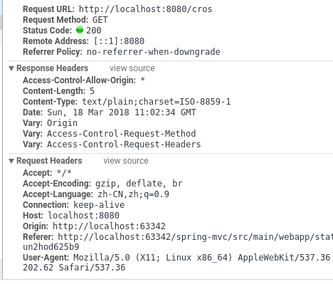
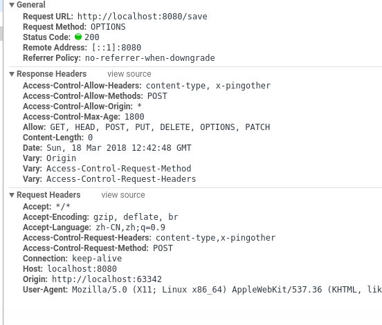
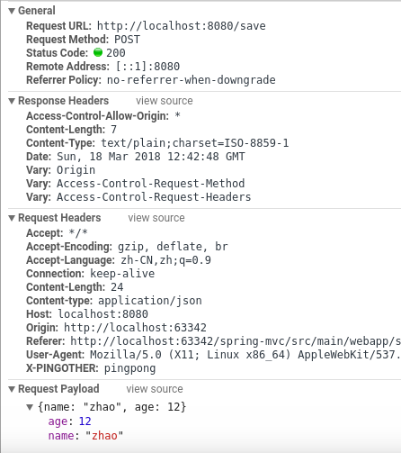

= SpringMVC CORS
:toc: left
:icons: font

== 简介
出于安全原因，浏览器禁止对当前站点以外的资源进行AJAX调用。 例如，您可以在一个标签页中访问银行帐户，在另一个标签页中使用evil.com。 来自evil.com的脚本不应该使用您的凭证向您的银行API发送AJAX请求，例如，从您的帐户中提取钱！

跨源资源共享（CORS）是大多数浏览器实现的W3C规范，允许您指定哪些类型的跨域请求被授权，而不是使用基于IFRAME或JSONP的不太安全和功能较弱的解决方法。

== HTTP规范

跨域资源共享标准新增了一组 HTTP 首部字段，允许服务器声明哪些源站有权限访问哪些资源。另外，规范要求，对那些可能对服务器数据产生副作用的 HTTP 请求方法（特别是 GET 以外的 HTTP 请求，或者搭配某些 MIME 类型的 POST 请求），浏览器必须首先使用 OPTIONS 方法发起一个预检请求（preflight request），从而获知服务端是否允许该跨域请求。服务器确认允许之后，才发起实际的 HTTP 请求。在预检请求的返回中，服务器端也可以通知客户端，是否需要携带身份凭证（包括 Cookies 和 HTTP 认证相关数据）。

我会分三个场景来介绍

=== 简单请求

某些请求不会触发 CORS 预检请求。本文称这样的请求为“简单请求”，请注意，该术语并不属于 Fetch （其中定义了 CORS）规范。若请求满足所有下述条件，则该请求可视为“简单请求”：

* 使用下列方法之一：
** GET
** HEAD
** POST
* Fetch 规范定义了对 CORS 安全的首部字段集合，不得人为设置该集合之外的其他首部字段。该集合为：
** Accept
** Accept-Language
** Content-Language
** Content-Type （需要注意额外的限制）
** DPR
** Downlink
** Save-Data
** Viewport-Width
** Width
* Content-Type 的值仅限于下列三者之一：
** text/plain
** multipart/form-data
** application/x-www-form-urlencoded
[source,java]
----
    @CrossOrigin
    @GetMapping("cros")
    public String hello() {
        return "hello";
    }

----

=== 预处理请求
与前述简单请求不同，“需预检的请求”要求必须首先使用 OPTIONS   方法发起一个预检请求到服务器，以获知服务器是否允许该实际请求。"预检请求“的使用，可以避免跨域请求对服务器的用户数据产生未预期的影响。

当请求满足下述任一条件时，即应首先发送预检请求：

* 使用了下面任一 HTTP 方法：
** PUT
** DELETE
** CONNECT
** OPTIONS
** TRACE
** PATCH
* 人为设置了对 CORS 安全的首部字段集合之外的其他首部字段。该集合为：
** Accept
** Accept-Language
** Content-Language
** Content-Type (but note the additional requirements below)
** DPR
** Downlink
** Save-Data
** Viewport-Width
** Width
* Content-Type 的值不属于下列之一:
** application/x-www-form-urlencoded
** multipart/form-data
** text/plain

[source,java]
----
    @CrossOrigin
    @PostMapping(value = "save", consumes ="application/json")
    public String save(@RequestBody String user) {
        System.err.println(user);
        return "success";
    }
----

从上面的报文中，我们看到，使用 OPTIONS 方法的“预检请求”。 OPTIONS 是 HTTP/1.1 协议中定义的方法，用以从服务器获取更多信息。该方法不会对服务器资源产生影响。 预检请求中同时携带了下面两个首部字段：
[source,shell]
----
Access-Control-Request-Headers:content-type,x-pingother
Access-Control-Request-Method:POST
----
首部字段 Access-Control-Request-Method 告知服务器，实际请求将使用 POST 方法。首部字段 Access-Control-Request-Headers 告知服务器，实际请求将携带两个自定义请求首部字段：X-PINGOTHER 与 Content-Type。服务器据此决定，该实际请求是否被允许。

再看响应字段
[source,shell]
----
Access-Control-Allow-Headers:content-type, x-pingother
Access-Control-Allow-Methods:POST
Access-Control-Allow-Origin:*
Access-Control-Max-Age:1800
Allow:GET, HEAD, POST, PUT, DELETE, OPTIONS, PATCH
----

首部字段 Access-Control-Allow-Methods 表明服务器允许客户端使用 POST, GET 和 OPTIONS 方法发起请求。

首部字段 Access-Control-Allow-Headers 表明服务器允许请求中携带字段 X-PINGOTHER 与 Content-Type。与 Access-Control-Allow-Methods 一样，Access-Control-Allow-Headers 的值为逗号分割的列表。

最后，首部字段 Access-Control-Max-Age 表明该响应的有效时间为 1800 秒，也就是30分钟。在有效时间内，浏览器无须为同一请求再次发起预检请求。请注意，浏览器自身维护了一个最大有效时间，如果该首部字段的值超过了最大有效时间，将不会生效。

== spring 支持

Spring MVC HandlerMapping提供了对CORS的内置支持。 在成功将请求映射到处理程序后，HandlerMapping会检查给定请求和处理程序的CORS配置并采取进一步的操作。预检请求被直接处理，而简单和实际的CORS请求被拦截，验证并且需要设置CORS响应头。

为了实现跨域请求（即Origin头域存在并且与请求的主机不同），你需要有一些明确声明的CORS配置。如果找不到匹配的CORS配置，则会拒绝预检请求。没有将CORS头添加到简单和实际的CORS请求的响应，因此浏览器拒绝它们。

Spring提供了基于注解的本地配置以及基于URL的CorsConfiguration的全局配置。

全局配置和本地配置可以一起使用，但是只有一个会起作用，本地配置会覆盖全局配置。

[NOTE]
====
要了解更多信息或进行高级自定义设置，请检查：

* CorsConfiguration
* CorsProcessor,DefaultCorsProcessor
* AbstractHandlerMapping
====

== @CrossOrigin
该注解可以被使用在类上和方法上。
[source,java]
----
@CrossOrigin(maxAge = 3600)
@RestController
@RequestMapping("/account")
public class AccountController {

    @CrossOrigin("http://domain2.com")
    @GetMapping("/{id}")
    public Account retrieve(@PathVariable Long id) {
        // ...
    }

    @DeleteMapping("/{id}")
    public void remove(@PathVariable Long id) {
        // ...
    }
}
----

@CrossOrigin默认允许：

* 所有的来源URL
* 所有的请求头
* 所有控制器允许的方法
* maxAge设置为30分钟。
* allowedCredentials默认情况下未启用，因为它建立了一个信任级别，用于公开敏感的用户特定信息，如Cookie和CSRF令牌，并且只能在适当的情况下使用。

== 全局配置
除了细粒度的控制器方法级配置之外，您还可能需要定义一些全局CORS配置。 您可以在任何HandlerMapping上分别设置基于URL的CorsConfiguration映射。 然而，大多数应用程序将使用MVC Java配置或MVC XNM命名空间来完成此操作。
[source,java]
----
@Configuration
@EnableWebMvc
public class WebConfig implements WebMvcConfigurer {

    @Override
    public void addCorsMappings(CorsRegistry registry) {

        registry.addMapping("/api/**")
            .allowedOrigins("http://domain2.com")
            .allowedMethods("PUT", "DELETE")
            .allowedHeaders("header1", "header2", "header3")
            .exposedHeaders("header1", "header2")
            .allowCredentials(true).maxAge(3600);

        // Add more mappings...
    }
}
----
[source,xml]
----

<mvc:cors>

    <mvc:mapping path="/api/**"
        allowed-origins="http://domain1.com, http://domain2.com"
        allowed-methods="GET, PUT"
        allowed-headers="header1, header2, header3"
        exposed-headers="header1, header2" allow-credentials="true"
        max-age="123" />

    <mvc:mapping path="/resources/**"
        allowed-origins="http://domain1.com" />

</mvc:cors>
----

== CORS Filter
您可以通过内置的CorsFilter来应用CORS支持。
配置过滤器将CorsConfigurationSource传递给其构造函数：
[source,java]
----
config.setAllowCredentials(true);
config.addAllowedOrigin("http://domain1.com");
config.addAllowedHeader("");
config.addAllowedMethod("");

UrlBasedCorsConfigurationSource source = new UrlBasedCorsConfigurationSource();
source.registerCorsConfiguration("/**", config);

CorsFilter filter = new CorsFilter(source);
----